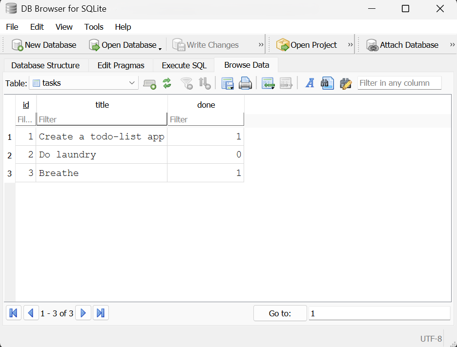
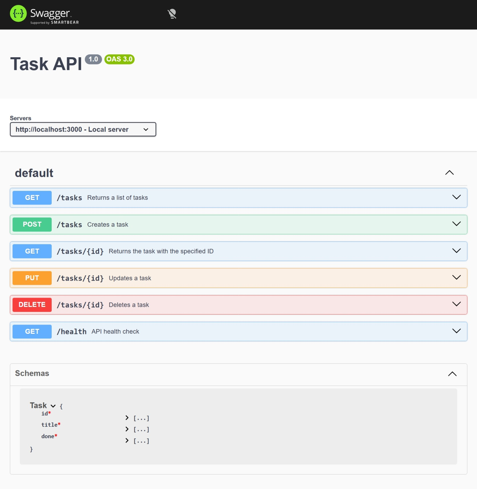

# Simple CRUD App

This is a small Express.js API with basic CRUD operations made for the FlyRank Backend Development track.

## Start the Project

```sh
npm install; node index.js
```

The server runs at `http://localhost:3000`, and Swagger UI is available at `http://localhost:3000/docs`.

## SQLite Database

SQLite was chosen to replace the previous in-memory approach because it simply stores the data in a single file, needs zero database server setup, and data survives app restarts.

The database file lives at:

```txt
tasks.db
```
which is created upon the app launch (if it doesn't already exist)

Example SQL query:

```sql
SELECT COUNT(*) FROM tasks;
```

Example response:

```txt
3
```

Database open in DB Browser:



## Endpoints

| Method | Endpoint | Description |
| --- | --- | --- |
| GET | `/` | API name, version, and basic endpoint list |
| GET | `/health` | Health check |
| GET | `/docs` | Swagger UI |
| GET | `/tasks` | List all tasks |
| POST | `/tasks` | Create a task with a JSON `title` |
| GET | `/tasks/:id` | Get task by ID |
| PUT | `/tasks/:id` | Update a task `title` and/or `done` value |
| DELETE | `/tasks/:id` | Delete a task by ID |

## Example `curl -i` Output

```http
$ curl -i http://localhost:3000/health
HTTP/1.1 200 OK
X-Powered-By: Express
Content-Type: application/json; charset=utf-8
Content-Length: 15
ETag: W/"f-VaSQ4oDUiZblZNAEkkN+sX+q3Sg"
Date: Tue, 28 Jul 2026 17:55:15 GMT
Connection: keep-alive
Keep-Alive: timeout=5

{"status":"ok"}
```

## Swagger Screenshot


